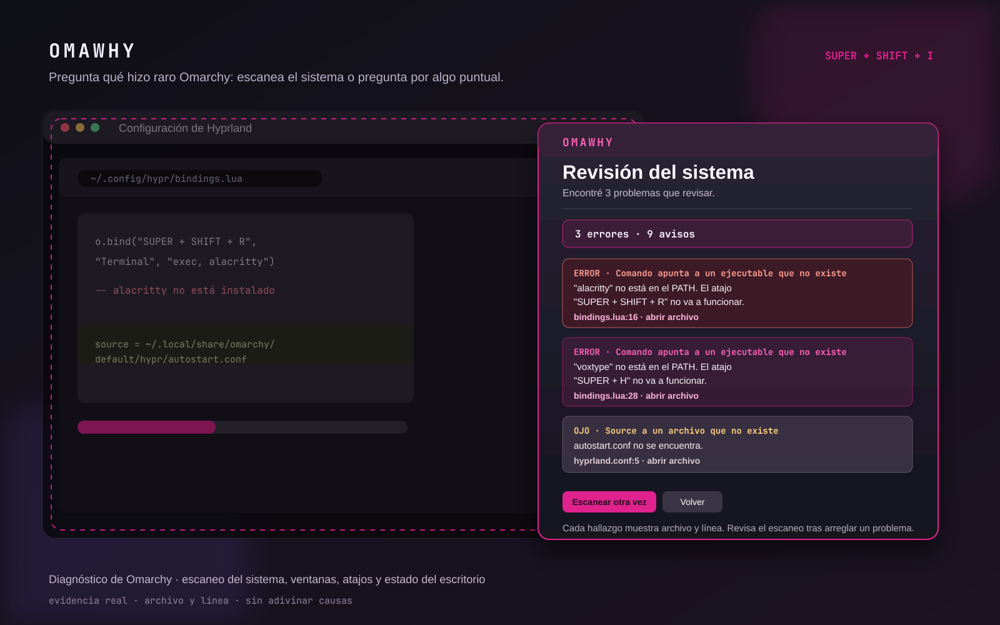

# OmaWhy

<p align="center">
  <a href="https://www.ko-fi.com/brmcl"></a>
</p>

**Ask why Omarchy did that — and get an answer backed by its real configuration.**

OmaWhy is an Omarchy Quattro diagnostic service. Open it and choose a real question:

- **A window ended up wrong**: find the rule that matches it, or prove no static rule did.
- **A shortcut does nothing**: search where it is defined, replaced, or explicitly disabled.
- **Check desktop status**: verify the active Hyprland configuration, Hyprland + Quickshell, and OmaWhy's own shortcut.

For a window, OmaWhy reads modern Omarchy Lua rules (`o.window(...)`) and classic `windowrule` files. It reports one of three useful facts:

- **A placement rule matches**: it shows the exact file, line, effects (workspace, monitor, floating, etc.) and whether the live state agrees.
- **Only style rules match**: opacity or tags affect the app, but they do **not** explain its workspace or monitor.
- **No static rule matches**: the position is coming from the layout, the app itself, or another automation — not a hidden line in your config.

Each match has an **Abrir archivo** action. From the same overlay, you can also correct the selected window or save its current placement as a reversible rule.



*Illustrated product preview based on the plugin interface; it is not a desktop screenshot.*

## Install

```bash
omarchy plugin add https://github.com/brm-src/omawhy.git --enable --yes
~/.config/omarchy/plugins/io.github.brm-src.omawhy/setup.sh
```

The second command adds exactly one marked binding and reloads Hyprland. It uses `~/.config/hypr/bindings.lua` on current Omarchy and falls back to `bindings.conf` on classic configurations:

```text
Super + Shift + I
```

It does not install packages, elevate permissions, access the network, or run automatically during `omarchy plugin add`.

## Use

1. Press `Super + Shift + I`.
2. Choose the question that matches what went wrong.
3. For a window, click it and read the answer: **a placement rule**, **style-only rules**, or **no static rule**.
4. For an atajo, write it as you press it (`Super Shift I`) and OmaWhy finds its definition or tells you it is disabled/missing.
5. For general trouble, use **Revisar estado del escritorio** before changing random files.
6. Only then use a small action or choose **Recordar** to create a reversible placement rule.

### Actions

- Copy app ID, XWayland class, title, or the generated rule.
- Move the selected window to the current workspace.
- Center it.
- Toggle floating, fullscreen, or pinning.
- Open the OmaWhy rule file.
- Undo the most recent saved rule.

### Remember this position

Before writing anything, OmaWhy shows the selected window's workspace, monitor, floating state, and other live facts.

On confirmation it writes a dedicated rule file and adds one marked include to your active configuration:

```text
Current Omarchy: ~/.config/hypr/omawhy.lua + require("hypr.omawhy") in hyprland.lua
Classic Hyprland: ~/.config/hypr/apps/omawhy.conf + source = … in apps.conf
```

It creates a timestamped backup in:

```text
~/.local/state/omawhy/backups/
```

**Undo** restores both files exactly to their state before the last Remember action.

Rules use an anchored app identifier: `o.window("^app_id$", …)` on current Omarchy and anchored `match:class` on classic Hyprland. The identifier is a Wayland `app_id` for native clients and an X11 class for XWayland clients. A remembered rule therefore applies to future windows with that same application identifier—not to an unverified title match. Edit the OmaWhy rule file if you want a narrower rule.

## Remove

```bash
~/.config/omarchy/plugins/io.github.brm-src.omawhy/setup.sh --remove
omarchy plugin remove io.github.brm-src.omawhy --yes
```

The first command removes only OmaWhy's marked hotkey block; it leaves the rest of your bindings alone.

## Requirements

- Omarchy Quattro
- Hyprland
- `python3`, `hyprctl`, and `wl-copy` (present on standard Omarchy installs)

No API keys, account, background service, external server, or telemetry.

## Development checks

```bash
python3 -m unittest discover -s tests -v
python3 -m py_compile omawhy.py
qmllint -I /usr/share/omarchy/shell OmaWhy.qml
omarchy plugin validate .
```

## License

MIT
